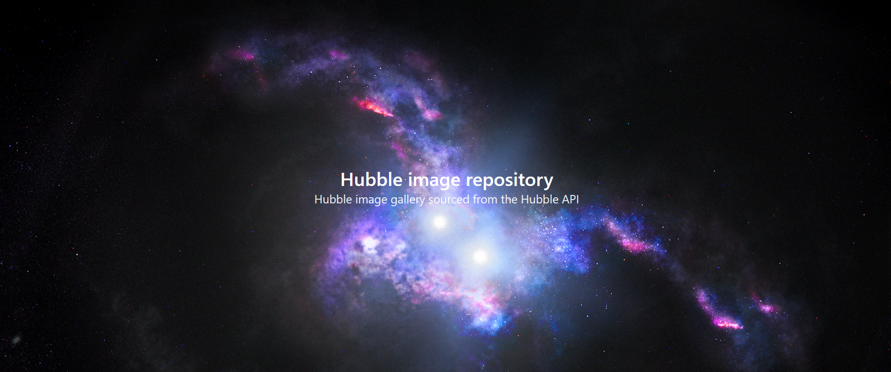

# Hubble API Gallery

https://hubblegallery.herokuapp.com/

A react project utilizing the Hubble API to display images from the Hubble telescope provided by NASA, ESA, and STScI.
The project uses an initial API call to pull a list of available image IDs, then maps through the IDs to make additional API calls for each.
The project then maps through these API calls to dynamically create cards with images, titles, and credits pulled from the API.

Currently, the project experiences a bug where the gallery page has to be reloaded using the navbar to load all of the content.
Refreshing the page will require the gallery to be loaded through the navbar again.

Additionally, STScI has uploaded some of the images as a pdf documents, causing a broken image in the gallery as the template uses image tags.

